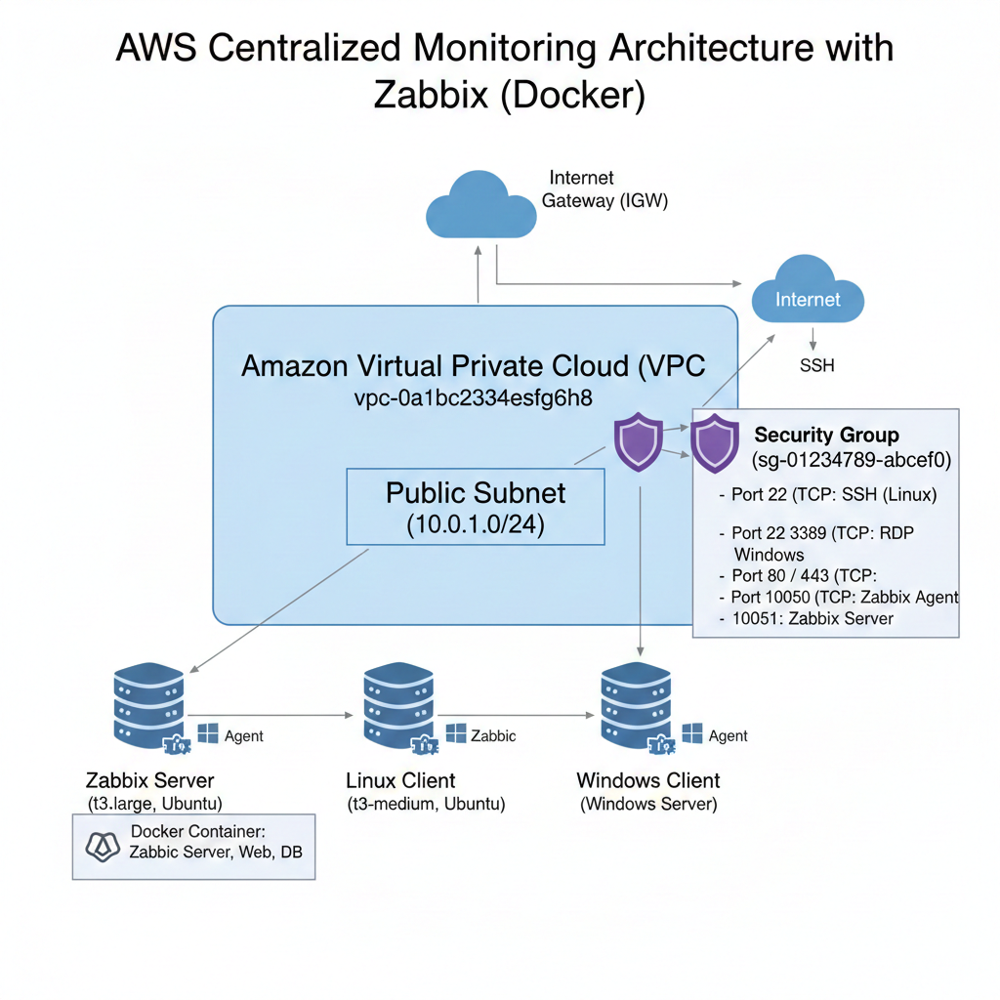
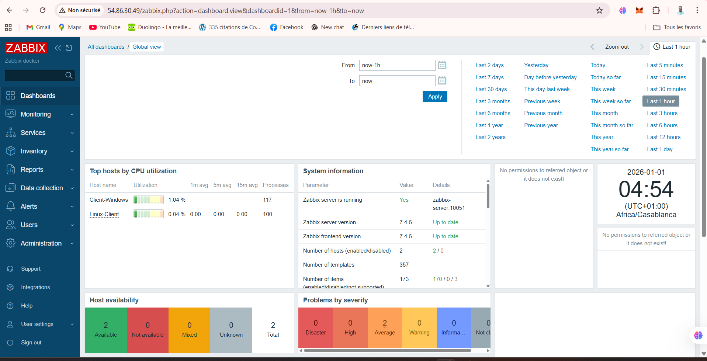

# Zabbix AWS Monitoring Project

## 1. Présentation du projet
Ce projet a pour objectif de mettre en place une **infrastructure de supervision centralisée** sur AWS utilisant **Zabbix**, capable de surveiller un environnement hybride composé de systèmes Linux et Windows. Le projet illustre le déploiement conteneurisé avec **Docker** et l’intégration d’agents Zabbix sur les clients.

La solution permet de :
- Collecter les métriques système (CPU, RAM, disque, charge réseau)
- Visualiser les données en temps réel via l’interface Web Zabbix
- Détecter les anomalies et générer des alertes automatiques
- Superviser un environnement mixte Linux et Windows

---

## 2. Architecture du projet

### 2.1 Infrastructure AWS


- **VPC** : Youssouf-VPC-Zabbix
- **Subnet public** : Youssouf-Subnet-Public
- **Security Group** : Youssouf-SG-Zabbix
- **Instances EC2** :
  - Serveur Zabbix (Ubuntu 22.04, t3.medium)
  - Client Linux (Ubuntu 22.04, t3.medium)
  - Client Windows (Windows Server, t3.medium)
- **Ports ouverts** :
  | Port | Protocole | Usage |
  |------|-----------|-------|
  | 22   | TCP       | SSH Linux |
  | 3389 | TCP       | RDP Windows |
  | 80/443 | TCP     | Interface Web Zabbix |
  | 10050 | TCP      | Agent Zabbix |
  | 10051 | TCP      | Serveur Zabbix |

---

### 2.2 Architecture logicielle
- **Serveur Zabbix** : Docker + Docker Compose avec conteneurs pour :
  - Zabbix Server
  - Base de données (MySQL/MariaDB)
  - Interface Web Zabbix
- **Clients supervisés** : Agents Zabbix installés sur Linux et Windows, communiquant avec le serveur via port 10050.

---

## 3. Installation et déploiement

### 3.1 Prérequis
- Instances AWS EC2 pour serveur et clients
- Docker et Docker Compose installés sur le serveur Zabbix
- Connexion SSH (Linux) et RDP (Windows)
- Clé privée pour accès SSH

### 3.2 Déploiement du serveur Zabbix

#### Étape 1 : Docker et Docker Compose
```bash
sudo apt update
sudo apt install docker.io docker-compose -y
sudo systemctl enable docker
sudo systemctl start docker
```

#### Étape 2 : Déploiement des conteneurs

Placez le fichier docker-compose.yml (voir ci-dessous) sur le serveur et lancez :

```bash
docker-compose up -d
```

#### Étape 3 : Accès Web

URL : http://<IP_PUBLIQUE_DU_SERVEUR_ZABBIX>/zabbix

Utilisateur : Admin

Mot de passe : zabbix

### 3.3 Installation des agents Zabbix

#### Linux
```bash
sudo apt update
sudo apt install zabbix-agent -y
sudo nano /etc/zabbix/zabbix_agentd.conf
# Modifiez :
Server=<IP_PRIVEE_SERVEUR_ZABBIX>
ServerActive=<IP_PRIVEE_SERVEUR_ZABBIX>
Hostname=Client-Linux

sudo systemctl restart zabbix-agent
sudo systemctl enable zabbix-agent
sudo systemctl status zabbix-agent
```

#### Windows

Télécharger l’agent depuis Zabbix downloads

Installer et configurer zabbix_agentd.conf :

```
Server=<IP_PRIVEE_SERVEUR_ZABBIX>
ServerActive=<IP_PRIVEE_SERVEUR_ZABBIX>
Hostname=Client-Windows
```

Démarrer le service Zabbix Agent (type de démarrage automatique)

---

## 4. Configuration des hôtes dans Zabbix

- Client Linux : groupe Linux servers, template Template OS Linux by Zabbix agent
- Client Windows : groupe Windows servers, template Template OS Windows by Zabbix agent

Vérifier que les statuts passent à Available et que les métriques remontent correctement.

---

## 5. Supervision et dashboards



Les métriques collectées incluent : CPU, RAM, espace disque, charge système et disponibilité réseau

Les dashboards Zabbix permettent :

- Visualisation en temps réel
- Analyse de l’état des hôtes
- Détection rapide des anomalies

Menu principal : Monitoring → Hosts → Latest data et Monitoring → Dashboard

---

## 6. Détection d’anomalies et alertes

Zabbix détecte automatiquement :

- Surcharge CPU
- Manque d’espace disque
- Indisponibilité d’un agent

Les alertes sont visibles via Monitoring → Problems

Les anomalies AWS (ex : services EC2) peuvent apparaître mais sont optionnelles pour le TP

---

## 7. Difficultés et solutions

Difficultés rencontrées :

- Connexion du serveur Zabbix à son propre agent
- Permissions MySQL lors de l’installation Docker
- Visualisation initiale des métriques Windows
- Gestion des templates et assignation aux hôtes

Solutions apportées :

- Suppression de l’enregistrement du serveur lui-même
- Reconfiguration Docker et MySQL
- Vérification des ports 10050 et connectivité réseau
- Attribution correcte des templates OS Linux et Windows

Utilisation des dashboards pour centraliser les métriques et alertes

---

## 8. Bilan final

- Supervision complète et temps réel des clients Linux et Windows
- Collecte et affichage des métriques CPU, RAM, disque et charge
- Détection et alertes automatiques en cas d’anomalie
- Infrastructure robuste, scalable et adaptée à un usage professionnel

---

## 9. Dépôt GitHub

Le dépôt GitHub contenant Docker Compose, configurations, scripts et documentation est disponible ici :
https://github.com/username/zabbix-aws-monitoring

---

## 10. Structure du dépôt
```
zabbix-aws-monitoring/
│
├─ README.md
├─ docker-compose.yml
├─ zabbix-server.conf
├─ zabbix-agent.conf
├─ scripts/
│   ├─ setup-linux.sh
│   └─ setup-windows.ps1
├─ docs/
│   ├─ installation.md
│   └─ configuration.md
└─ diagrams/
    ├─ architecture.png
    └─ dashboard.png